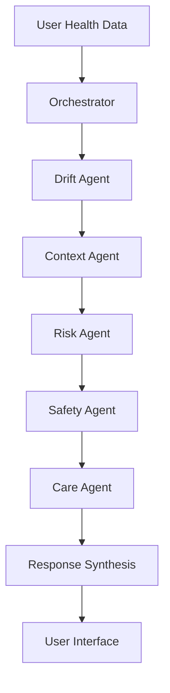

# 📚 MediGuard Drift AI - Project Documentation

## 📋 Table of Contents
- [Project Overview](#project-overview)
- [Workflows](#workflows)
- [Tech Stack](#tech-stack)
- [APIs & Services](#apis--services)
- [Architecture](#architecture)

---

## 🎯 Project Overview

**MediGuard Drift AI** is an intelligent health monitoring platform that combines computer vision-based activity tracking with a sophisticated multi-agent AI system to detect, analyze, and respond to subtle health changes over time.

### Key Capabilities
- 📹 **Vision-Based Activity Tracking** - Real-time movement analysis
- 🤖 **Multi-Agent AI System** - 5-agent pipeline for health insights
- 📊 **Health Drift Detection** - Statistical analysis of health trends
- 💬 **AI Health Chat** - Conversational health assistant
- 🔐 **Secure Authentication** - Privacy-protected health records

---

## 🔄 Workflows

### 1️⃣ **User Onboarding Workflow**
```
Sign Up → Email Verification → Profile Setup → Context Input → First Health Check
```

**Steps:**
1. User creates account (email + password)
2. Supabase sends verification email
3. User completes health profile
4. User provides lifestyle context (sleep, stress, diet)
5. User performs first daily health check

---

### 2️⃣ **Daily Health Check Workflow**
```
Login → Activity Selection → Camera/Video Upload → Movement Analysis → Results Display → Data Storage
```

**Steps:**
1. **Login**: User authenticates via Supabase
2. **Activity Selection**: Choose from 3 activities:
   - Sit-to-Stand Test (10 seconds)
   - Stability Test (10 seconds)
   - Movement Speed Test (10 seconds)
3. **Recording**: 
   - **Option A**: Live camera (WebRTC)
   - **Option B**: Upload pre-recorded video
4. **Analysis**: Extract movement features using OpenCV
5. **Results**: Display metrics (speed, stability, smoothness)
6. **Storage**: Save to Supabase database

**Metrics Tracked:**
- Movement Speed
- Stability Score
- Motion Smoothness
- Posture Deviation
- Range of Motion

---

### 3️⃣ **AI Analysis Workflow (Multi-Agent Pipeline)**

#### **High-Level Flow**
```
Health Data → Orchestrator → Agent Pipeline → Response Synthesis → User Display
```

#### **Detailed Agent Processing Flow**



**Step-by-Step Agent Execution:**

**1. Drift Agent** 🔍
```
Input: Current + Historical Health Metrics
Process:
  ├─ Calculate metric changes (Δ values)
  ├─ Compute statistical significance
  ├─ Identify trends (improving/declining/stable)
  └─ Generate drift report
Output: Numerical drift analysis
```

**Responsibilities:**
- Compare current vs previous health metrics
- Calculate percentage changes
- Detect statistically significant deviations
- Classify drift severity (minor/moderate/major)

**Example Output:**
```json
{
  "movement_speed": {"change": -8%, "trend": "declining", "severity": "moderate"},
  "stability": {"change": -4%, "trend": "declining", "severity": "minor"}
}
```

---

**2. Context Agent** 🧠
```
Input: Drift Report + User Context Data
Process:
  ├─ Fetch lifestyle factors (sleep, stress, diet)
  ├─ Correlate changes with context
  ├─ Identify potential causes
  └─ Generate explanation
Output: Contextual analysis
```

**Responsibilities:**
- Analyze sleep patterns
- Evaluate stress levels
- Review dietary changes
- Consider environmental factors
- Correlate lifestyle with health changes

**Example Output:**
```json
{
  "likely_causes": ["Poor sleep (5 hrs)", "High stress (8/10)"],
  "correlations": {"sleep_quality": -0.7, "stress_level": 0.6}
}
```

---

**3. Risk Agent** ⚠️
```
Input: Drift Report + Context Analysis
Process:
  ├─ Evaluate temporal patterns
  ├─ Assess trend velocity
  ├─ Calculate risk score
  └─ Determine urgency level
Output: Risk assessment
```

**Responsibilities:**
- Analyze rate of change
- Evaluate trend persistence
- Assess cumulative risk
- Determine intervention urgency
- Classify concern level (low/medium/high)

**Example Output:**
```json
{
  "risk_score": 6.5,
  "urgency": "medium",
  "concern_level": "moderate",
  "trend_velocity": "accelerating"
}
```

---

**4. Safety Agent** 🛡️
```
Input: All Previous Agent Outputs
Process:
  ├─ Apply ethical guardrails
  ├─ Check escalation criteria
  ├─ Evaluate medical necessity
  └─ Generate safety recommendation
Output: Safety decision
```

**Responsibilities:**
- Determine if medical consultation needed
- Apply ethical guidelines
- Ensure responsible recommendations
- Flag critical conditions
- Prevent harmful advice

**Example Output:**
```json
{
  "medical_consultation": "recommended",
  "urgency": "within 48 hours",
  "red_flags": ["persistent decline", "multiple metrics affected"]
}
```

---

**5. Care Agent** 💚
```
Input: All Agent Outputs
Process:
  ├─ Synthesize all insights
  ├─ Generate actionable recommendations
  ├─ Personalize language
  └─ Create user-friendly response
Output: Final care guidance
```

**Responsibilities:**
- Create unified response
- Generate actionable steps
- Personalize recommendations
- Use empathetic language
- Provide specific guidance

**Example Output:**
```
"Your movement speed has decreased by 8% over the past week. This appears 
related to reduced sleep (5 hours vs your usual 7 hours) and increased stress.

Recommendations:
1. Prioritize 7-8 hours of sleep tonight
2. Try 10-minute relaxation exercises
3. Consider consulting your doctor if decline continues
4. Monitor your progress over next 3 days"
```

---

### 4️⃣ **AI Chat Workflow**

#### **Complete Chat Processing Flow**
```
User Input → Intent Recognition → Data Retrieval → AI Processing → 
Pattern Matching → Response Generation → Visualization → Display
```

**Detailed Steps:**

**Step 1: User Input Processing**
```
Input: User question
Process:
  ├─ Clean and normalize text
  ├─ Extract intent
  └─ Identify required data
```

**Step 2: Health Data Retrieval**
```
Query Supabase:
  ├─ Fetch user health records
  ├─ Get context data
  ├─ Retrieve historical trends
  └─ Load user profile
```

**Step 3: Context Building**
```
Build AI Context:
  ├─ Format health data
  ├─ Add user information
  ├─ Include conversation history
  └─ Attach system instructions
```

**Step 4: Gemini AI Processing**
```
Send to Gemini:
  ├─ User question + context
  ├─ Model: gemini-2.5-flash
  ├─ Temperature: 0.8
  └─ Max tokens: 4096
```

**Step 5: Pattern Matching**
```
Check for common patterns:
  ├─ Trend queries → Generate chart
  ├─ Comparison queries → Show table
  ├─ Advice queries → List recommendations
  └─ General queries → Text response
```

**Step 6: Response Enhancement**
```
Enhance response:
  ├─ Add visualizations (Plotly charts)
  ├─ Include data tables
  ├─ Format with markdown
  └─ Add emoji for readability
```

**Example Chat Flows:**

**Query Type 1: Trend Analysis**
```
User: "How is my stability trending?"
  ↓
Fetch: Last 7 days stability data
  ↓
AI: Analyze trend pattern
  ↓
Generate: Line chart + summary
  ↓
Display: "Your stability has improved 5% this week! 📈"
```

**Query Type 2: Factor Analysis**
```
User: "What affects my balance?"
  ↓
Fetch: Health + context data
  ↓
AI: Correlate factors
  ↓
Generate: Factor analysis
  ↓
Display: "Sleep quality (70% correlation), Stress (45% correlation)"
```

---

### 5️⃣ **Data Storage Workflow**

#### **Complete Data Pipeline**
```
Activity Completion → Feature Extraction → Validation → 
Transformation → Database Insert → Confirmation → Cache Update
```

**Detailed Data Flow:**

**Step 1: Feature Extraction**
```
Input: Video frames (numpy arrays)
Process:
  ├─ Frame-by-frame motion analysis
  ├─ Calculate movement metrics
  ├─ Compute statistical features
  └─ Generate feature vector
Output: Movement features dict
```

**Features Extracted:**
- Movement speed (0-1 scale)
- Stability score (0-1 scale)
- Motion smoothness (0-1 scale)
- Posture deviation (0-1 scale)
- Micro-movements (0-1 scale)
- Range of motion (0-1 scale)
- Acceleration variance
- Frame count

**Step 2: Data Validation**
```
Pydantic Validation:
  ├─ Check data types
  ├─ Validate ranges (0-1)
  ├─ Ensure required fields
  └─ Sanitize inputs
```

**Step 3: Data Transformation**
```
Transform for storage:
  ├─ Add user_id
  ├─ Add timestamp
  ├─ Format as JSON
  └─ Prepare metadata
```

**Step 4: Database Insert**
```
Supabase Insert:
  ├─ Connect to database
  ├─ Insert into health_records table
  ├─ Handle conflicts
  └─ Return insert ID
```

**Step 5: Confirmation**
```
User Feedback:
  ├─ Display success message
  ├─ Show saved metrics
  ├─ Update UI state
  └─ Clear form data
```

---

### 6️⃣ **Video Processing Workflow**

#### **Live Camera (WebRTC)**
```
Camera Permission → WebRTC Connection → Frame Capture → 
Processing → Analysis → Display Results
```

**Detailed Steps:**

**Step 1: WebRTC Setup**
```
Initialize:
  ├─ Load ICE servers from secrets
  ├─ Configure STUN/TURN
  ├─ Create WebRTC context
  └─ Request camera permission
```

**Step 2: Connection Establishment**
```
Connect:
  ├─ Try STUN servers (Google)
  ├─ Fallback to TURN (Metered.ca)
  ├─ Establish peer connection
  └─ Start video stream
```

**Step 3: Frame Capture**
```
Recording:
  ├─ Capture frames at 30 FPS
  ├─ Sample every 3rd frame
  ├─ Convert to RGB
  └─ Store in memory
```

**Step 4: Processing**
```
Analysis:
  ├─ Extract movement features
  ├─ Calculate metrics
  └─ Generate results
```

#### **Video Upload (Fallback)**
```
File Upload → Temporary Storage → Frame Extraction → 
Processing → Cleanup → Display Results
```

**Detailed Steps:**

**Step 1: File Upload**
```
Upload:
  ├─ Accept MP4/AVI/MOV/WEBM
  ├─ Validate file size (<50MB)
  ├─ Check format
  └─ Load into memory
```

**Step 2: Temporary Storage**
```
Save:
  ├─ Create temp file
  ├─ Write video data
  └─ Get file path
```

**Step 3: Frame Extraction**
```
Extract with OpenCV:
  ├─ Open video file
  ├─ Read frames sequentially
  ├─ Sample every 3rd frame
  ├─ Convert BGR → RGB
  └─ Store in array
```

**Step 4: Processing**
```
Analyze:
  ├─ Run feature extraction
  ├─ Calculate metrics
  └─ Generate results
```

**Step 5: Cleanup**
```
Cleanup:
  ├─ Delete temp file
  ├─ Clear memory
  └─ Release resources
```

---

### 7️⃣ **Error Handling Workflow**

#### **WebRTC Connection Failure**
```
Connection Timeout → Display Warning → 
Offer Upload Option → User Choice → Alternative Flow
```

**Handling:**
1. Detect timeout (>30 seconds)
2. Show warning message
3. Enable upload checkbox
4. Guide user to alternative
5. Process uploaded video

#### **Database Error**
```
Insert Failure → Retry Logic → 
Fallback Storage → User Notification
```

**Handling:**
1. Catch database exception
2. Retry insert (max 3 times)
3. Log error details
4. Notify user
5. Offer manual retry

#### **AI Processing Error**
```
API Failure → Check Error Type → 
Apply Fallback → Return Graceful Response
```

**Handling:**
1. Catch Gemini API error
2. Check error type (quota/network/safety)
3. Use fallback response
4. Log for debugging
5. Inform user gracefully

---

## 🛠️ Tech Stack

### **Frontend**
| Technology | Purpose | Company |
|------------|---------|---------|
| **Streamlit** | Web framework | Snowflake Inc. |
| **Plotly** | Interactive charts | Plotly Technologies |
| **Matplotlib** | Data visualization | NumFOCUS |

### **Backend & Database**
| Technology | Purpose | Company |
|------------|---------|---------|
| **Supabase** | Database + Auth | Supabase Inc. |
| **Python 3.x** | Core language | Python Software Foundation |
| **python-dotenv** | Environment config | Open Source |

### **Computer Vision**
| Technology | Purpose | Company |
|------------|---------|---------|
| **OpenCV** | Video processing | OpenCV Foundation |
| **streamlit-webrtc** | Live camera | Open Source |
| **av** | Video codec | PyAV |
| **NumPy** | Numerical computing | NumFOCUS |
| **Pillow** | Image processing | Open Source |

### **AI & Machine Learning**
| Technology | Purpose | Company |
|------------|---------|---------|
| **Google Gemini AI** | Language model | Google DeepMind |
| **google-generativeai** | Gemini SDK | Google |
| **Pydantic** | Data validation | Pydantic Services |

### **Utilities**
| Technology | Purpose | Company |
|------------|---------|---------|
| **requests** | HTTP library | Open Source |
| **reportlab** | PDF generation | ReportLab |
| **pdf2image** | PDF processing | Open Source |

---

## 🔌 APIs & Services

### 1️⃣ **Google Gemini API**
**Provider:** Google DeepMind  
**Purpose:** AI-powered health chat and analysis

**Features Used:**
- Natural language understanding
- Context-aware responses
- Multi-turn conversations
- Structured output generation

**Model:** `gemini-2.5-flash`

**Configuration:**
```python
GOOGLE_API_KEY = "your_api_key"
Model: gemini-2.5-flash
Temperature: 0.8
Max Tokens: 4096
```

**Endpoints:**
- `generateContent` - Single prompt
- `startChat` - Multi-turn conversation

---

### 2️⃣ **Supabase API**
**Provider:** Supabase Inc.  
**Purpose:** Database, authentication, and storage

**Services Used:**
- **Authentication**: Email/password auth
- **Database**: PostgreSQL with real-time
- **Storage**: User health records

**Configuration:**
```python
SUPABASE_URL = "your_project_url"
SUPABASE_ANON_KEY = "your_anon_key"
```

**Tables:**
- `users` - User profiles
- `health_records` - Daily check results
- `user_context` - Lifestyle data

**API Methods:**
- `auth.sign_up()` - User registration
- `auth.sign_in_with_password()` - Login
- `table().insert()` - Save data
- `table().select()` - Fetch data

---

### 3️⃣ **WebRTC (streamlit-webrtc)**
**Provider:** Open Source  
**Purpose:** Real-time camera access in browser

**Features:**
- Live video streaming
- Frame capture
- Person detection overlay

**TURN/STUN Servers:**
- Google STUN: `stun.l.google.com:19302`
- Metered.ca TURN: `global.relay.metered.ca`

**Configuration:**
```python
rtc_configuration = {
    "iceServers": [
        {"urls": ["stun:stun.l.google.com:19302"]},
        {"urls": ["turn:global.relay.metered.ca:80"], 
         "username": "...", "credential": "..."}
    ]
}
```

---

### 4️⃣ **OpenCV API**
**Provider:** OpenCV Foundation  
**Purpose:** Video processing and feature extraction

**Features Used:**
- Video capture (`VideoCapture`)
- Frame processing
- Color conversion (BGR ↔ RGB)
- Motion analysis (frame differencing)

**Key Functions:**
```python
cv2.VideoCapture() - Camera access
cv2.cvtColor() - Color conversion
cv2.imread() - Image loading
```

---

## 🏗️ Architecture

### **System Architecture**
```
┌─────────────────────────────────────────────────────────┐
│                    User Interface                        │
│                    (Streamlit)                          │
└─────────────────────────────────────────────────────────┘
                          │
        ┌─────────────────┼─────────────────┐
        │                 │                 │
        ▼                 ▼                 ▼
┌──────────────┐  ┌──────────────┐  ┌──────────────┐
│   Vision     │  │   AI Agent   │  │     Auth     │
│   System     │  │   Pipeline   │  │   System     │
│  (OpenCV)    │  │  (Gemini)    │  │ (Supabase)   │
└──────────────┘  └──────────────┘  └──────────────┘
        │                 │                 │
        └─────────────────┼─────────────────┘
                          ▼
                  ┌──────────────┐
                  │   Database   │
                  │  (Supabase)  │
                  └──────────────┘
```

### **Data Flow**
```
User Input → Camera/Upload → OpenCV Processing → 
Feature Extraction → Supabase Storage → 
AI Analysis → Gemini Processing → User Response
```

### **Project Structure**
```
MediGuard/
├── app.py                    # Main entry point
├── requirements.txt          # Dependencies
│
├── agents/                   # AI agent system
│   ├── orchestrator.py      # Agent coordination
│   ├── drift_agent.py       # Drift detection
│   ├── context_agent.py     # Context analysis
│   ├── risk_agent.py        # Risk assessment
│   ├── safety_agent.py      # Safety checks
│   ├── care_agent.py        # Care recommendations
│   └── adk_runtime.py       # Gemini integration
│
├── pages/                    # Streamlit pages
│   ├── daily_health_check.py
│   ├── dashboard.py
│   ├── ai_health_chat.py
│   └── profile.py
│
├── storage/                  # Data layer
│   ├── database.py
│   ├── health_repository.py
│   └── context_repository.py
│
├── vision/                   # Computer vision
│   ├── camera.py
│   ├── feature_extraction.py
│   └── person_detection.py
│
└── auth/                     # Authentication
    └── supabase_auth.py
```

---

## 📊 Feature Comparison

| Feature | Local Mode | Cloud Mode |
|---------|------------|------------|
| Camera Access | OpenCV | WebRTC |
| Video Upload | ✅ | ✅ |
| Person Detection | ✅ | ❌ |
| Frame Rate | 30 FPS | Variable |
| Latency | Low | Medium |

---

## 🔐 Security & Privacy

- **Encryption**: HTTPS for all data transmission
- **Authentication**: Supabase JWT tokens
- **Data Isolation**: User-specific records
- **Privacy**: No data sharing with third parties
- **Compliance**: Healthcare data sensitivity

---

## 📈 Performance Metrics

- **Frame Processing**: ~30 FPS (local), ~15 FPS (cloud)
- **Analysis Time**: 2-3 seconds per activity
- **AI Response**: 1-2 seconds average
- **Database Query**: <100ms
- **Video Upload**: Supports up to 50MB

---

## 🚀 Deployment

**Platform:** Streamlit Cloud  
**URL:** https://mediguard-feb6sybhmnworzdxmyngid.streamlit.app

**Environment Variables:**
- `SUPABASE_URL`
- `SUPABASE_ANON_KEY`
- `GOOGLE_API_KEY`
- `STREAMLIT_APP_URL`
- `VISION_API_KEY`
- `VISION_MODEL`

---

## 📝 Version History

- **v2.0.0** (Dec 2024) - Multi-agent AI system, WebRTC support
- **v1.0.0** (Nov 2024) - Initial release

---

**Last Updated:** December 24, 2024  
**Status:** Active Development  
**License:** [Specify License]
