# 📊 MediGuard Workflows - Visual Diagrams

This document contains visual flowcharts for all major workflows in MediGuard.

---

## 1️⃣ User Onboarding Workflow

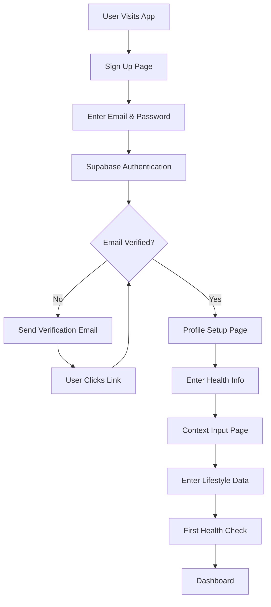

---

## 2️⃣ Daily Health Check Workflow

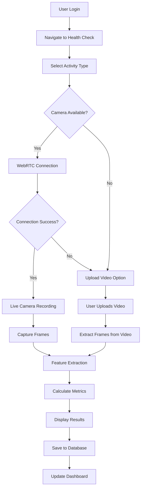

---

## 3️⃣ Multi-Agent AI Pipeline

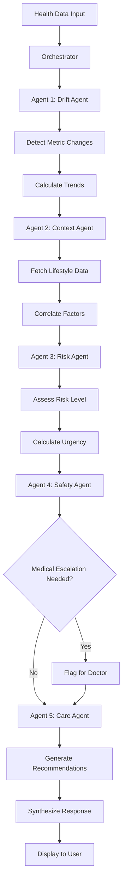

---

## 4️⃣ AI Health Chat Workflow

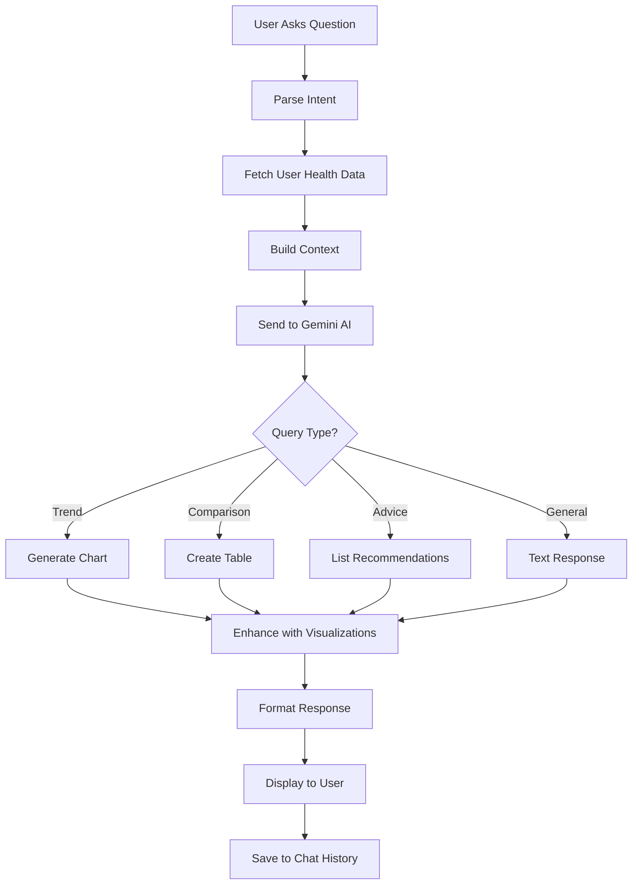

---

## 5️⃣ Data Storage Workflow

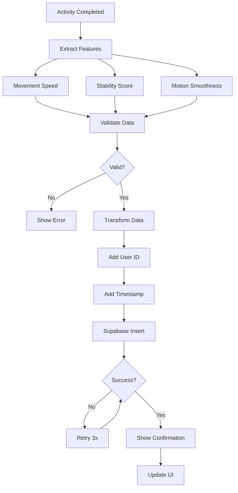

---

## 6️⃣ WebRTC Video Processing

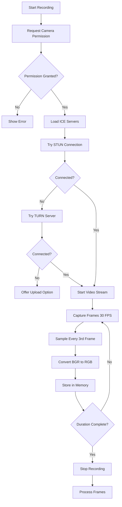

---

## 7️⃣ Video Upload Processing

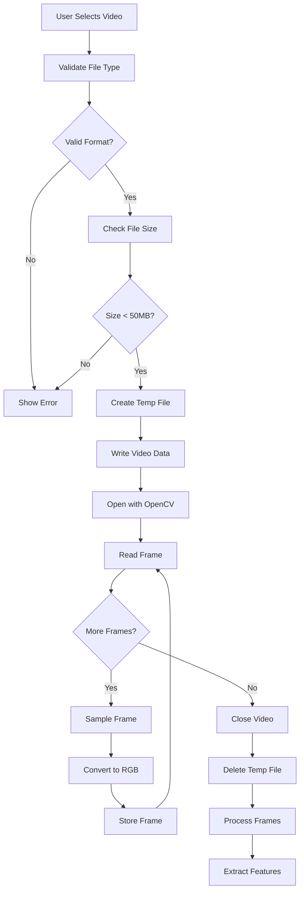

---

## 8️⃣ Error Handling Flow

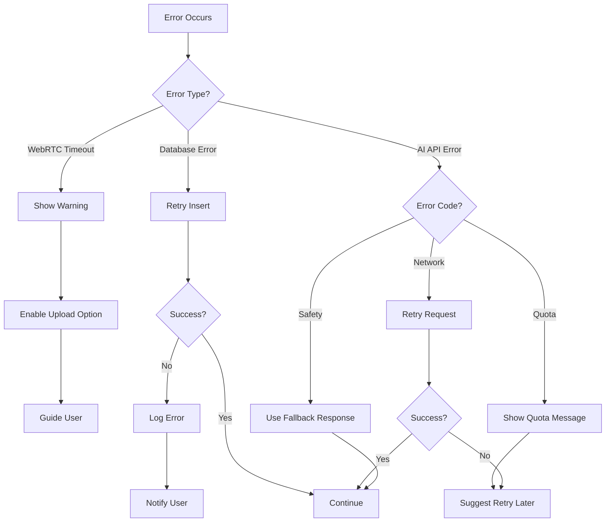

---

## 9️⃣ Authentication Flow

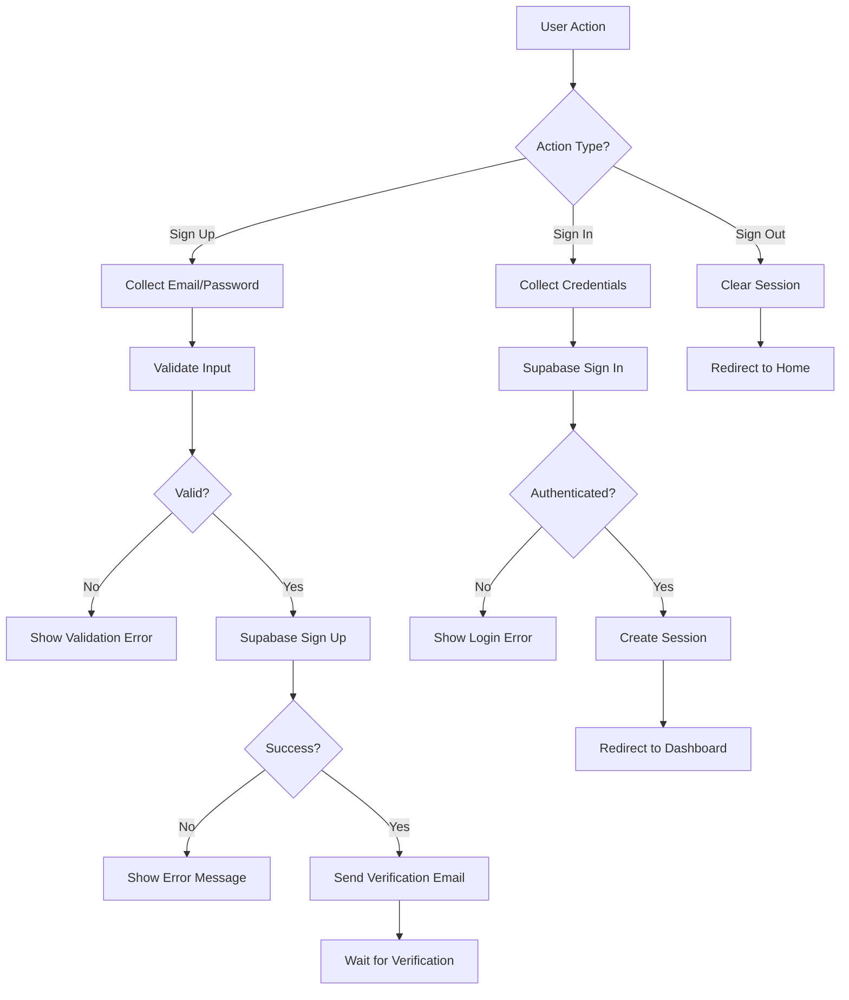

---

## 🔟 Feature Extraction Pipeline

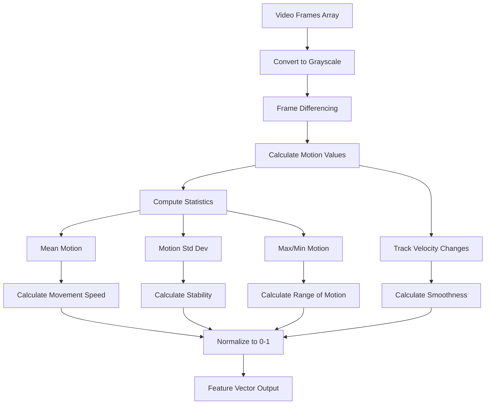

---

## 1️⃣1️⃣ Database Schema Flow

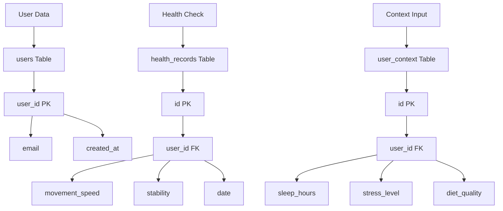

---

## 1️⃣2️⃣ Complete System Architecture

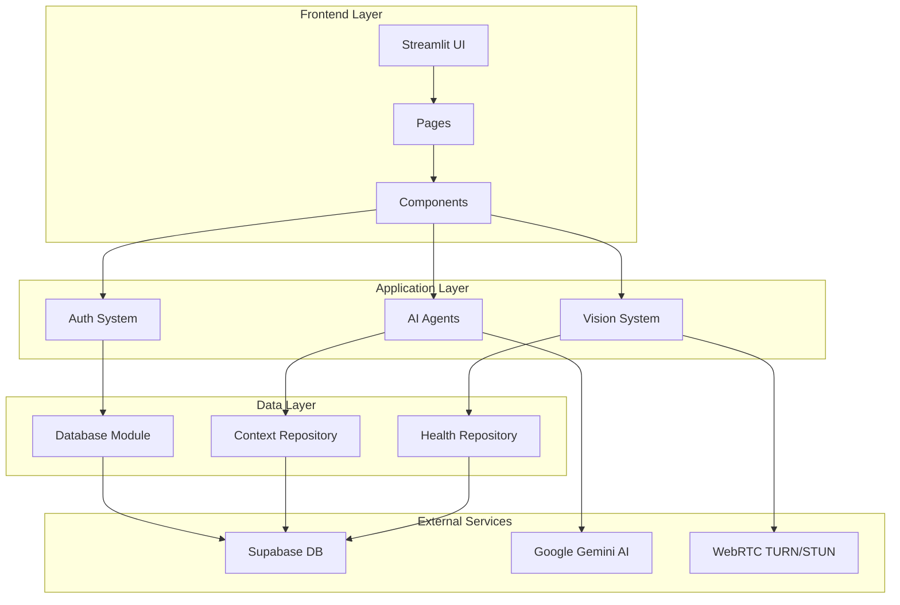

---

**Note:** These diagrams use Mermaid syntax and will render as interactive flowcharts in GitHub, VS Code, and other Markdown viewers that support Mermaid.
